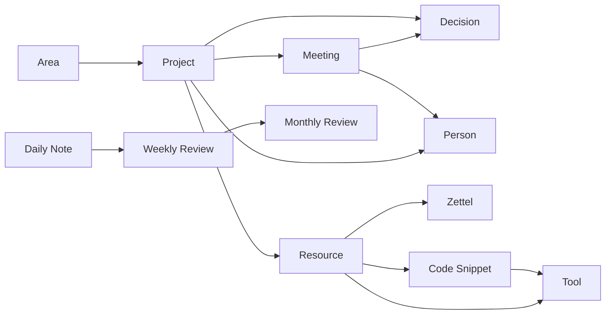

# Templates MOC

Zentrale Übersicht aller Templates im Firstbrain Vault.

## Überblick

Templates sind vordefinierte Strukturen für konsistente Notizen. Sie beschleunigen das Erfassen von Informationen und sorgen für einheitliche Formatierung.

---

## Note Types

### Lifecycle & Planning
| Template | Type | Zweck |
|----------|------|-------|
| [[Project]] | project | Projekte planen und verfolgen |
| [[Area]] | area | Verantwortungsbereiche verwalten |
| [[Decision]] | decision | Entscheidungen dokumentieren |
| [[Meeting]] | meeting | Besprechungen protokollieren |

### Reviews & Journaling
| Template | Type | Zweck |
|----------|------|-------|
| [[Daily Note]] | daily | Tägliche Planung und Reflexion |
| [[Weekly Review]] | review | Wöchentliches Review |
| [[Monthly Review]] | review | Monatliches Review |

### Knowledge & Resources
| Template | Type | Zweck |
|----------|------|-------|
| [[Zettel]] | zettel | Atomare Ideen und Gedanken |
| [[Resource]] | resource | Bücher, Artikel, Quellen |
| [[Code Snippet]] | code-snippet | Wiederverwendbarer Code |
| [[Tool]] | tool | Werkzeuge und Software |

### People
| Template | Type | Zweck |
|----------|------|-------|
| [[Person]] | person | Kontakte und Beziehungen |

---

## Template-Beziehungen

---

## Quick Links

- Alle Templates: `05 - Templates/`
- Neue Notiz erstellen: [[Create]] Skill nutzen
- Template ändern: Datei in `05 - Templates/` bearbeiten

---

## Verwandte MOCs

- [[Projekte]]
- [[Lebensbereiche]]
- [[Ressourcen]]
